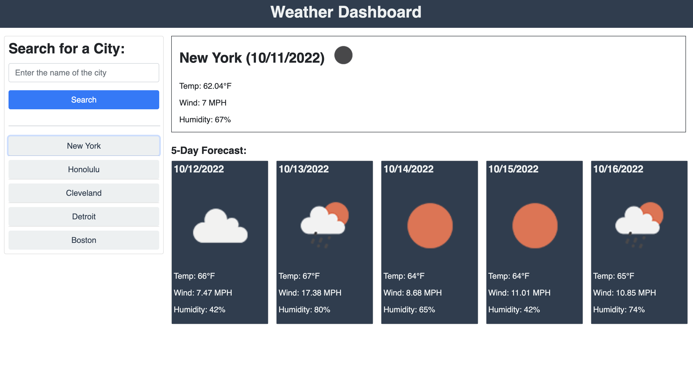
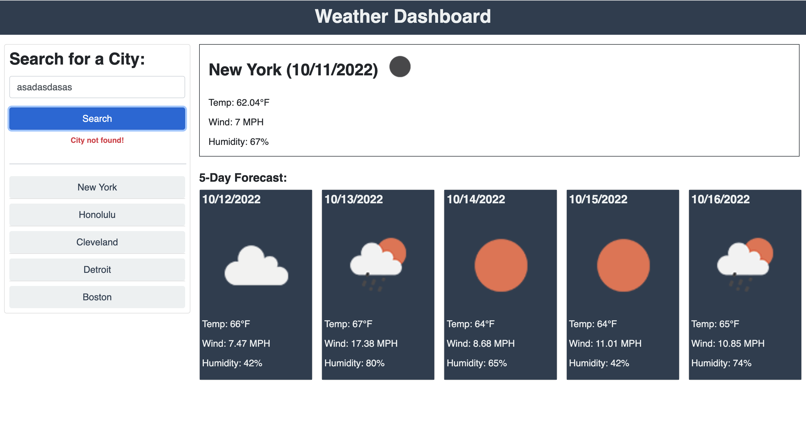

# Weather Dashboard

## Description

This is a simple application that allows a user to search for a city and display the current and five day forecasts. Search history is save in local storage and is displayed as buttons, for easy access.  If the city is not found, then a message is displayed stating so. The data is coming from OpenWeather API, including the icons.

---

## Usage

To visit site, navigate to the following HTTP address:

[https://mikeyboxx.github.io/weather-dashboard/](https://mikeyboxx.github.io/weather-dashboard/)

---

## Screenshot

The following images show the web application's appearance and functionality:

---

